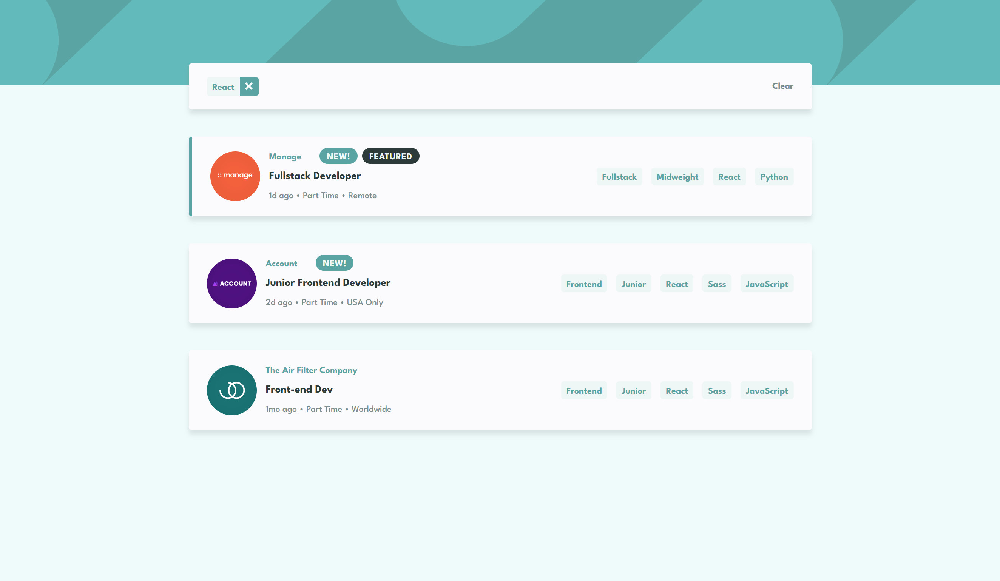

# Frontend Mentor - Job listings with filtering solution

This is a solution to the [Job listings with filtering challenge on Frontend Mentor](https://www.frontendmentor.io/challenges/job-listings-with-filtering-ivstIPCt). Frontend Mentor challenges help you improve your coding skills by building realistic projects. 

## Table of contents

- [Overview](#overview)
  - [The challenge](#the-challenge)
  - [Screenshot](#screenshot)
  - [Links](#links)
- [My process](#my-process)
  - [Built with](#built-with)
  - [What I learned](#what-i-learned)
  - [Continued development](#continued-development)
  - [Useful resources](#useful-resources)
- [Author](#author)

## Overview

### The challenge

Users should be able to:

- View the optimal layout for the site depending on their device's screen size
- See hover states for all interactive elements on the page
- Filter job listings based on the categories

### Screenshot

### Links

- Live Site URL: [Job Listings Challenge](https://job-listings-challenge-omega.vercel.app/)

## My process

### Built with

- [React](https://reactjs.org/) - JS library
- CSS modules
- CSS custom properties
- Flexbox
- CSS Grid
- Mobile-first workflow

### What I learned

I used this project as an opportunity to practice some React skills, particularly using state and splitting up the project into components.

I also used CSS modules for each component which made styling this project very manageable. In the future I'd like to combine this with Sass for greater flexibility, though I wanted to focus on the React side for this challenge.

I'm really happy with the structure and organisation of my code in this project, everything was easy to work with because of how small each component ended up being.

The logic for making the filtering work was fairly straightforward in the end, I only needed one piece of state to keep track of the filter list.

### Continued development

I'd like to build more React projects after this one, particularly using more hooks. 

I had a lot of fun working out how to plan this project out and structure it into components, and it would be nice to build on that with more challenging functionality in my next challenge.

I'd also like to implement Sass into my next project to make my styling even cleaner.

### Useful resources

- [Josh's Custom CSS Reset](https://www.joshwcomeau.com/css/custom-css-reset/) - A very cool CSS reset that I used to save a little time on my styling for this project.

## Author

- Frontend Mentor - [@jameshamling](https://www.frontendmentor.io/profile/jameshamling)
